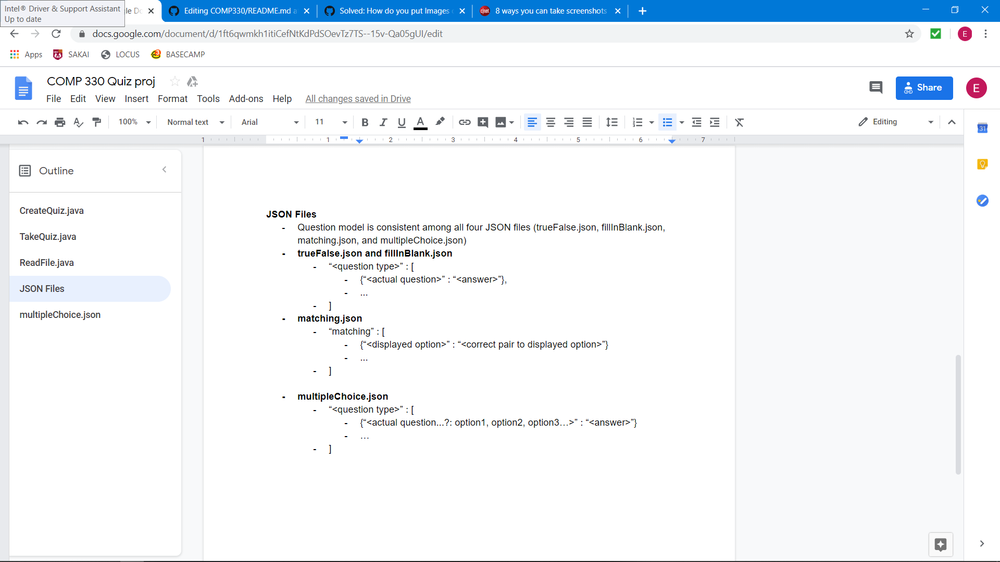

# Quizzing System
This repository is the home of all of our source code, documentation, and data files that we will use to complete our quizzing system
in COMP 330. This README.md file will be updated since we are in the starting stages of design and just starting development. The
purpose of this project is to create a simple quiz system that will take user input and output whether or not they got the proposed
question correct. As of right now, we are continually working on reading in true/false questions from our json file. We are planning to use Java as our server code and JSON to store our data for easy access. The project is only in the making to be a simple command line program but will be upgraded as time goes on.
## Getting Started
In order to run the startings of our code on your system, there are a few things you must do.
### Prerequisites
First, you must have installed a [JVM (Java Virtual Machine)](https://www.java.com/en/) installed as well as the library we are using to parse our json file called [JSON-SIMPLE](http://www.java2s.com/Code/Jar/j/Downloadjsonsimple11jar.htm). Ideally, you will have downloaded the JSON-SIMPLE library and saved it under an easily accessible directory. Once you have downloaded the two, you must append to your machine's CLASSPATH environment variable with the following commands:

This for linux systems:

```bash
export CLASSPATH=$CLASSPATH:/path/to/jar
```

For Windows systems, simply navigate to the start menu and right-click on the Windows icon. Click on 'Search' and type in 'environment variables' and press enter. Once you have done that, a window will pop up with many options. Click on the button that says 'Environment Variables'. Next, navigate to system variables and click 'New'. The 'Variable name' will be 'CLASSPATH' and the 'Variable value' will be the path to which you saved JSON-Simple to. Once you are finished, continually click 'Ok' on each window as they disappear. You may need to restart your system in order for the changes to be set.

# Notes
We only have the ability to create a quiz. The quiz questions are put into the following format:


